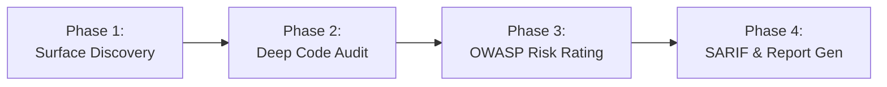

# AppSec Auditor (OWASP ASTF, ASVS v4.0.3 & Risk Rating)

This skill equips the agent to perform enterprise-grade Application Security audits across web applications, REST/GraphQL/gRPC APIs, database access layers, and cloud integrations.

It applies the **OWASP API Security Testing Framework (ASTF)**, normative criteria from **OWASP ASVS v4.0.3 (Level 2)**, and calculates risk deterministically using the **OWASP Risk Rating Methodology** (Likelihood $\times$ Impact).

---

## When to Use

Use this skill whenever:
* The user asks to audit the security of an API, controller, route handler, or backend repository.
* Verifying code against **OWASP Top 10**, **OWASP API Top 10 2023**, or **OWASP ASVS**.
* Investigating access control vulnerabilities (**BOLA / IDOR / BFLA**), multi-tenant data leakage, or Mass Assignment.
* Auditing outbound requests for **Server-Side Request Forgery (SSRF)** or DNS rebinding.
* Reviewing authentication, password hashing (**Argon2id**), JWT signing, or session fixation risks.
* Generating compliant **SARIF 2.1.0** reports for GitHub Code Scanning / GitLab Security or executive PDF/Markdown reports.

## When NOT to Use

* For pre-implementation architecture threat modeling before code exists (use `threat-modeler` or `prompts/security/threat_modeling.md`).
* For pure unit test creation without security abuse testing (use `driven-development`).
* For fast System 1 runtime guardrails or prompt screening (use `jev-system-one`).

---

## 4-Phase Audit Workflow



### Phase 1: Attack Surface Discovery & Contract Mapping
1. **Map Entry Points:** Scan routers, controllers, handlers, GraphQL schemas, and gRPC definitions.
2. **Contract Comparison:** Compare OpenAPI/Swagger specs with live controllers to detect **Shadow/Zombie APIs** (ASVS V13.2.2).
3. **Identify Trust Boundaries:** Mark unauthenticated public endpoints vs authenticated multi-tenant routes.

### Phase 2: Systematic Code Inspection (Zero Speculative Assumptions)
Audit each file line by line against the core vulnerability vectors. Consult the modular references:
* [OWASP ASTF & API Top 10 Guide](references/owasp-api-astf.md)
* [ASVS v4.0.3 Verification Checklist](references/asvs-v4-checklist.md)
* [Access Control & BOLA Deep Dive](references/access-control-bola.md)
* [SSRF Prevention & Safe Egress](references/ssrf-prevention.md)

> [!IMPORTANT]
> **Anti-Fatigue Directive:** Report ONLY findings verified by inspected source code. Filter out purely cosmetic formatting or styling suggestions (`[NIT]`). Focus on actual **Blast Radius**.

### Phase 3: Deterministic OWASP Risk Rating
Calculate the practical risk using the [Risk Rating Methodology](references/risk-rating-methodology.md):

$$\text{Risco} = \text{Probabilidade (Likelihood)} \times \text{Impacto (Impact)}$$

* **Alta $\times$ Alto** = 🔴 **CRÍTICA** (Remote Code Execution, public unauthenticated BOLA, leaked master keys).
* **Alta $\times$ Médio** ou **Média $\times$ Alto** = 🟠 **ALTA** (Cross-tenant IDOR, missing tenancy filter in update).
* **Média $\times$ Médio** ou **Baixa $\times$ Alto** = 🟡 **MÉDIA** (Stored XSS requiring admin view, missing rate limit).
* **Baixa $\times$ Baixo** = 🔵 **BAIXA** (Verbose technical banner, missing non-critical header).

### Phase 4: Artifact Generation & Remediation
1. **Terminal Prioritization Table:** Present a quick-wins summary table.
2. **Defensive Code Fixes:** Provide drop-in patches implementing defense-in-depth.
3. **Automated Verification:** Provide a reproducible test or curl command to verify the fix.
4. **SARIF 2.1.0 Export:** Execute the built-in `sarif_builder.py` script.

---

## Executable Tools & Scripts in this Skill

### 1. Generating SARIF 2.1.0 for GitHub / CI/CD
The skill includes `scripts/sarif_builder.py` to create standards-compliant SARIF output from findings:

```bash
python3 skills/appsec-auditor/scripts/sarif_builder.py \
  --input findings.json \
  --output results.sarif
```

### 2. Generating Markdown Executive Reports & Issue Templates
The skill includes `scripts/report_generator.py` to produce full audit documentation:

```bash
python3 skills/appsec-auditor/scripts/report_generator.py \
  --input findings.json \
  --output docs/security-audit-report.md \
  --issues-dir docs/issues/
```

### Format of `findings.json`:
```json
[
  {
    "id": "SEC-001",
    "title": "BOLA in Invoice Retrieval Endpoint",
    "description": "Endpoint /api/invoices/:id queries DB by primary key without checking organizationId.",
    "severity": "CRITICAL",
    "file_path": "src/controllers/invoice.controller.ts",
    "start_line": 42,
    "end_line": 48,
    "owasp": "API1:2023",
    "asvs": "V13.1.1",
    "cwe": "CWE-639",
    "likelihood": "Alta",
    "impact": "Alto",
    "effort": "Baixo",
    "quick_win": true,
    "remediation": "Enforce req.user.organizationId in prisma query.",
    "verification": "pytest tests/test_bola.py"
  }
]
```

---

## Verified Code References & Examples
* [Automated BOLA Abuse Test Example](examples/bola_idor_test.py): Real pytest test case testing cross-tenant isolation.
* [SSRF-Safe Fetch Client](examples/ssrf_safe_fetch.ts): TypeScript client with pre-flight DNS check and IP pinning.
