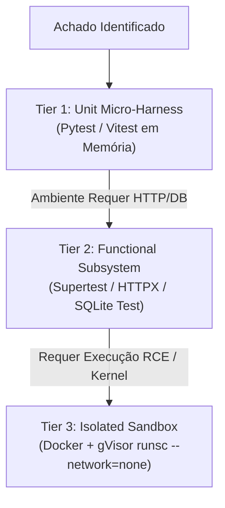

# PoC Reproduction Harness & Tiered Verification

Inspired by the **Google Mantis** reproducer architecture (`mantis-reproduce`), this reference guides the creation of deterministic, reproducible Proof-of-Concept (PoC) test harnesses to validate security vulnerabilities with zero false positives.

---

## 1. The Tiered Reproduction Strategy

Never rely solely on static guesses. When validating high-impact vulnerabilities, structure reproducers across three progressive tiers:



| Tier | Escopo & Dependências | Velocidade | Risco de Execução | Exemplo Típico |
| :--- | :--- | :--- | :--- | :--- |
| **Tier 1: Unit Micro-Harness** | Teste unitário em memória; mocks de auth e sessão; sem I/O de rede. | <100ms | Nulo (Seguro para CI/CD) | Teste BOLA/IDOR passando tenant_id forjado no service/query. |
| **Tier 2: Functional Subsystem** | Roda o controller com SQLite em memória ou mock server (`httpx` / `supertest`). | 1s - 5s | Baixo | Teste de Mass Assignment enviando `{ role: "ADMIN" }` via HTTP. |
| **Tier 3: Isolated Sandbox** | Container isolado sem acesso à rede externa; gVisor runtime (`runsc`). | 5s - 30s | Médio a Alto (Isolamento Obrigatório) | PoC de desserialização insegura, prototype pollution ou command injection. |

---

## 2. Sandbox Security Directives (Mantis Hardening)

> [!CAUTION]
> **Regra de Ouro de Segurança para Execução de PoCs:**
> NUNCA execute código de reprodução gerado por IA diretamente no host se envolver injeção de comandos, desserialização ou parsing de binários.
> Use **Tier 1 (Unit)** por padrão. Se precisar de **Tier 3**, utilize Docker com runtime `runsc` (gVisor) sem rede:
> ```bash
> docker run --runtime=runsc --network=none --rm -v $(pwd):/app:ro target-repro-image
> ```

---

## 3. Templates de Micro-Harness Reproducíveis

### Exemplo Tier 1: Micro-Harness Unitário para BOLA/IDOR (Python / Pytest)
```python
# test_repro_bola.py
import pytest
from unittest.mock import MagicMock

def test_repro_bola_cross_tenant_access_fails():
    """
    PoC Micro-Harness: Verifica se o serviço rejeita acesso a recurso de outro tenant.
    Se a vulnerabilidade existir, esta asserção falhará (status 200 ao invés de 403/404).
    """
    mock_db = MagicMock()
    # Simula documento pertencente ao tenant_A
    mock_db.find_one.return_value = {"id": "doc-123", "org_id": "tenant_A", "data": "confidential"}
    
    attacker_context = {"user_id": "usr-attacker", "org_id": "tenant_B"}
    
    # Invoca o método com o contexto do atacante
    # O comportamento seguro DEVE lançar PermissionError ou retornar None
    with pytest.raises(PermissionError):
        from app.services.documents import get_document
        get_document(doc_id="doc-123", current_user=attacker_context, db=mock_db)
```

### Exemplo Tier 2: Subsystem Functional HTTP (TypeScript / Vitest + Supertest)
```typescript
// test_repro_mass_assignment.spec.ts
import request from "supertest";
import { describe, it, expect } from "vitest";
import { app } from "../src/app";

describe("PoC: Mass Assignment in Profile Update", () => {
  it("should NOT allow setting isAdmin flag via profile update endpoint", async () => {
    const userToken = "bearer user-token";
    
    const response = await request(app)
      .patch("/api/users/profile")
      .set("Authorization", userToken)
      .send({
        name: "Attacker User",
        isAdmin: true, // Payload de exploração
      });

    // Se vulnerável, o servidor aceita e reflete isAdmin: true
    expect(response.body.isAdmin).not.toBe(true);
    expect(response.body.role).not.toBe("ADMIN");
  });
});
```

---

## 4. Integração no `findings.json`

Ao criar ou atualizar achados, especifique os detalhes de reprodução:

```json
{
  "id": "SEC-001",
  "title": "BOLA in Document Retrieval",
  "severity": "CRITICAL",
  "viability": "RELEASE_EXPLOITABLE",
  "risk_score": 9.5,
  "poc_tier": "TIER_1_UNIT",
  "poc_reproducer": "tests/repro_sec_001.py",
  "verification": "pytest tests/repro_sec_001.py"
}
```
