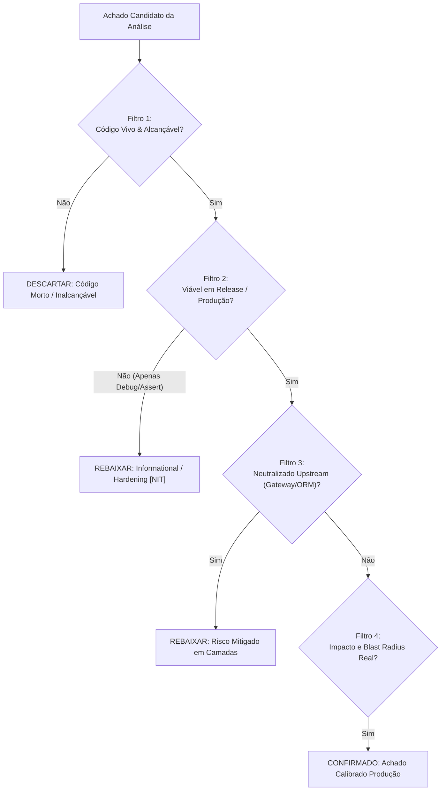

# Viability Critique & Anti-Hallucination Protocol

Inspired by the **Google Mantis** critic architecture (`mantis-critic` & `mantis-review`), this reference provides the normative verification protocol to eliminate false positives and verify **real-world production viability** before reporting vulnerabilities.

---

## 1. The Anti-Hallucination Imperative

LLMs analyzing source code frequently report theoretical vulnerabilities based on isolated pattern matching without checking contextual defenses, configuration defaults, or runtime execution modes.

> [!CAUTION]
> **Zero Unverified Assertions Directive:**
> A finding MUST NOT be reported as CRITICAL or HIGH if its exploitability depends on debug-only artifacts, uncalled dead code, or mechanisms completely neutralized by the runtime environment.

---

## 2. The 4 Viability Filters



### Filter 1: Reachability & Dead Code Elimination
* **Active Routing Check:** Is the function, controller, or handler mapped to an active route in the router/mux?
* **Call Graph Reachability:** Trace the call chain from an external entry point (HTTP, WebSocket, RPC, message queue) down to the vulnerable sink.
* **Dead Code Heuristic:** If a function has a vulnerability but has zero references across the entire repository and is not an exported library API, discard or mark as dead code.

### Filter 2: Release Build vs. Debug Mode
* **Python `assert` Flaw:** `assert condition, "error"` is completely stripped out of bytecode when running in optimized mode (`python -O` or `PYTHONOPTIMIZE=1`). Never treat `assert` as a valid security boundary, and never report a DoS based on `assert` failing if it only halts debug runs.
* **Development Middleware:** Check if dangerous or permissive configurations are wrapped in environment guards:
  ```typescript
  if (process.env.NODE_ENV !== 'production') {
    app.use(cors({ origin: '*' })); // NÃO vulnerável em produção
  }
  ```
* **Debug Endpoints:** Confirm whether routes like `/debug/pprof`, `/api/dev/reset-db` or Swagger UI are conditional or excluded from production bundles.

### Filter 3: Upstream & Framework-Level Neutralization
* **Global Validation Pipes:** In frameworks like NestJS, Fastify, or Express com Zod:
  - If a DTO strips unknown fields (`whitelist: true` / `stripUnknown: true`), Mass Assignment / Parameter Tampering is **neutralized**.
* **Reverse Proxy / Ingress Stripping:**
  - Standard clouds and ingress controllers (AWS ALB, Nginx, Cloudflare) strip hop-by-hop headers (`Transfer-Encoding`, `Connection`) and normalize URI paths (`/../../`). Do not report path traversal if reverse proxy path canonicalization renders it unreachable unless proven.
* **ORM Scoping:**
  - Even if a raw string interpolation is visible, check if the variable is cast to an enum, parsed as an integer, or sanitized upstream.

### Filter 4: Actual Blast Radius vs. Theoretical Concern
* Ask: *What can an external or authenticated attacker actually achieve?*
* If an attacker triggers an unhandled exception that simply returns HTTP 500 without leaking memory, secrets, or hanging the event loop, classify as **LOW / NIT** (Bad Practice), not a High-severity DoS.

---

## 3. Viability Verdict Categories in `findings.json`

Every verified finding must be stamped with a `viability` property:

| Viability Tag | Meaning | Effect on Severity |
| :--- | :--- | :--- |
| `RELEASE_EXPLOITABLE` | Directly exploitable in production release builds. | Mantis Score Multiplier: **1.0x** |
| `UPSTREAM_MITIGATED` | Vulnerability exists in handler but is filtered by reverse proxy or gateway. | Mantis Score Multiplier: **0.6x** (Downgrade to Medium/Low) |
| `DEBUG_ONLY` | Exploitable only in local dev or with debug flags enabled. | Mantis Score Multiplier: **0.3x** (Downgrade to Low/NIT) |
| `DEAD_CODE` | Code is unreachable from public or private interfaces. | **Descartado / Not reported in SARIF** |

---

## 4. The Static Assessment Tuple (Codex Security Standard)

To eliminate false positives deterministically, an auditor or agent must identify the smallest useful evidence tuple before confirming any vulnerability:

- **Source:** The untrusted external trigger, user-controlled parameter, header, or body property.
- **Control:** The specific guard, sanitizer, validator, or missing security control.
- **Sink:** The dangerous operation (e.g., ORM query, command execution, memory allocation, sensitive data response).
- **Reachable Path:** The demonstrable call sequence connecting `Source` $\rightarrow$ `Control` $\rightarrow$ `Sink` under concrete preconditions.
- **Boundary:** The trust boundary violated (e.g., public API vs. internal network, multi-tenant separation).
- **Counterevidence:** Specific static facts in the repository that weaken, defeat, or scope down the claim (e.g., upstream middleware, DTO validation pipes, strict typing).
- **Proof Gaps:** Material missing facts that prevent a stronger conclusion (e.g., dynamic dependency resolution, uninspected environment flags).

> **Rule:** If Counterevidence proves the sink is unreachable or sanitized, the finding is discarded. If material Proof Gaps exist, confidence and severity must be explicitly downgraded.

---

## 5. The Evidence Chain Contract (Evidence → Finding → Path)

To eliminate unverified claims and speculative vulnerabilities, every verified security finding must follow the strict Evidence Contract:

> [!IMPORTANT]
> **Normative Finding Rule:**
> A finding (`F-{nnn}`) CANNOT be confirmed or exported to SARIF / Issue Tracker without at least one immutable evidence record (`E-{nnn}`).

### Structure of an Evidence Record (`E-{nnn}`)

Each piece of static or dynamic evidence must document:

```yaml
### E-001
- source_type: code | test | command | config | log
- source_ref: "src/controllers/invoice.controller.ts#L42-L48"
- content_hash: "sha256:e3b0c44298fc1c149afbf4c8996fb92427ae41e4649b934ca495991b7852b855"
- repro_command: "pytest tests/security/test_bola.py -k test_invoice_access" # Ou "offline_static_inspection"
- raw_excerpt: |
    // Desensitized code excerpt proving the unsanitized sink or missing boundary
    const invoice = await prisma.invoice.findUnique({ where: { id: req.params.id } });
- linked_finding: "F-001"
```

### Deterministic Requirements for Confirmation:
1. **Reproducibility (`repro_command`):** The auditor must provide either an automated micro-test command, a static assertion command, or mark as `offline_static_inspection`.
2. **Fixity Hash (`content_hash`):** The SHA-256 of the affected source file or code snippet must be recorded to guarantee audit immutability across commits.
3. **Desensitization:** Evidence excerpts must be desensitized — never embed real production secrets, API tokens, or PII.

