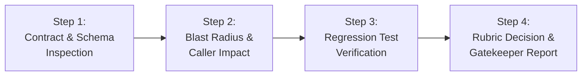

# Assess Patch Risk (Auto-Merge & Regression Gatekeeper)

This skill equips the agent to perform **immutable, objective risk assessments on patches, pull requests, and commit ranges**, determining whether a change is safe for automated merging or requires mandatory human review.

Directly adapted from the **OpenAI Codex Security** patch governance engine (`assess-patch-risk`), it operates strictly in **read-only mode**: it evaluates code without editing, applying, pushing, or merging it.

---

## When to Use

Use this skill whenever:
* You have a generated patch file (`.patch` / `.diff`) or Pull Request and need to decide: *Can this be auto-merged safely into production?*
* Evaluating regression risk, caller blast radius, and public API contract preservation.
* Implementing automated pull request gatekeeping in CI/CD pipelines (GitHub Actions, GitLab CI).
* Classifying patches into formal workflow labels (`auto_merge_candidate` vs. `human_review_required` vs. `block`).

## When NOT to Use

* For creating, generating, or hardening a security fix with a Red/Blue loop (use `adversarial-patching` or `prompts/security/adversarial_patching.md`).
* For hunting new vulnerabilities in a PR diff (use `security-diff-scan` or `prompts/security/security_diff_scan.md`).
* For whole-repository penetration testing without an immutable patch (use `appsec-auditor`).

---

## The 5-Point Recommendation Rubric

For every analyzed patch, emit exactly ONE recommendation and its respective workflow label:

| Recommendation | Workflow Label | Strict Eligibility Criteria |
| :--- | :--- | :--- |
| **`merge`** | `auto_merge_candidate` | **All strict gates pass:** No database migration/schema changes, no public API contract modifications, strong regression test coverage included, contained blast radius, immediate clean reversibility. |
| **`merge`** | `human_review_required` | The patch is correct and safe, but impacts sensitive areas: database schemas, public API signatures, authentication/authorization core, payment logic, or breaking configuration. |
| **`revise`** | `revise` | The patch has defects: missing test cases, potential edge-case regressions, strictness that rejects valid user inputs, or incomplete type checking. |
| **`block`** | `block` | Affirmative evidence of broken security invariants, introduced vulnerabilities, severe contract breaks, or destructive side effects. |
| **`hold`** | `hold_for_evidence` | Essential verification context is unavailable (e.g., test suite cannot be run, contract specifications missing). |

---

## 4-Step Evaluation Workflow



### Step 1: Contract & Schema Inspection
Inspect whether the diff modifies:
* Public API signatures, DTOs, or route parameter types.
* Database schemas (`schema.prisma`, SQL migrations, ORM entity definitions).
* Global middleware or dependency versions.
* *If any of these are modified, the patch is excluded from `auto_merge_candidate`.*

### Step 2: Caller Impact & Blast Radius Analysis
Trace how many callers rely on the modified functions:
* Is the change isolated to a private helper or leaf node?
* Does the change alter the return type or exception behavior of a shared core function?

### Step 3: Regression Test Verification
Verify evidence of automated verification:
* Does the patch bundle new unit or integration tests?
* Do the tests prove both the bug fix AND the preservation of legitimate user inputs?

### Step 4: Decision & Gatekeeper Report
Execute the standalone evaluation script to generate the structured verdict:
```bash
python3 skills/assess-patch-risk/scripts/patch_risk_checker.py --patch fix.patch --format markdown
```

---

## Executable Tool in this Skill

### `scripts/patch_risk_checker.py`
A deterministic CLI tool that evaluates patch files and emits the formal recommendation:

```bash
# Evaluate a patch file:
python3 skills/assess-patch-risk/scripts/patch_risk_checker.py --patch changes.diff

# Output JSON for CI/CD automation:
python3 skills/assess-patch-risk/scripts/patch_risk_checker.py --patch changes.diff --format json
```
