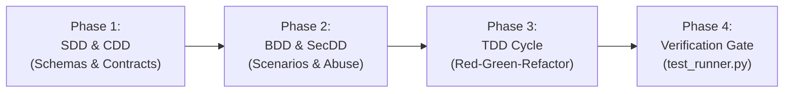

# Driven Development & Test Engineering (SDD, TDD, BDD, CDD, SecDD)

This skill guides the agent to engineer production software through formal **Driven Development methodologies**:
* **Spec-Driven Development (SDD):** Schemas as single source of truth (Zod, Pydantic, TypeBox) with compile-time type inference.
* **Test-Driven Development (TDD):** The deterministic Red-Green-Refactor cycle and edge-case invariants.
* **Behavior-Driven Development (BDD):** Living documentation with Gherkin scenarios (`Given/When/Then`) and state machine transitions.
* **Contract-Driven Development (CDD):** OpenAPI/Pact consumer-driven contracts preventing breaking changes.
* **Security-Driven Development (SecDD):** Automated abuse cases and evil user stories.

---

## When to Use

Use this skill whenever:
* Creating a new feature, endpoint, service, or architectural component from scratch.
* Writing or refactoring tests to cover edge cases, error conditions, and state transitions.
* Generating a complete test suite across the Test Pyramid (Unit, Integration, E2E, Load).
* Defining strict validation schemas before writing controllers or database models.
* Verifying behavioral compliance using the built-in test runner.

## When NOT to Use

* For deep vulnerability audits on existing production code (use `appsec-auditor`).
* For sub-100ms classification, routing, or agent tool guardrails (use `jev-system-one`).
* For cloud infrastructure provisioning or Kubernetes hardening (use `devops-hardening`).

---

## The 4-Phase Driven Development Lifecycle



### Phase 1: Specification & Contract First (SDD / CDD)
1. **Never write implementation code first.**
2. Define the runtime schema (e.g. Zod `.strict()`) as the **Single Source of Truth**.
3. Infer TypeScript/Python types directly from the schema (`z.infer<typeof Schema>`).
4. Validate that API contracts conform to OpenAPI/Pact specs.
* Guide: [Spec-Driven Development Reference](references/sdd-spec-driven.md)
* Guide: [Contract-Driven Testing Reference](references/cdd-contract-testing.md)

### Phase 2: Acceptance Scenarios & Abuse Cases (BDD / SecDD)
1. Write business requirements in Gherkin (`Given/When/Then`).
2. Define boundary state transitions in a `Scenario Outline`.
3. Draft the **Evil User Story** (e.g. concurrent race condition, BOLA access attempt).
* Guide: [BDD & Living Documentation](references/bdd-gherkin-scenarios.md)
* Guide: [SecDD Abuse Cases & Exploit Tests](references/secdd-abuse-cases.md)

### Phase 3: The TDD Cycle (Red-Green-Refactor)
1. **🔴 RED:** Write the unit test asserting the expected invariant. Run the test to confirm it fails.
2. **🟢 GREEN:** Write the minimal code needed to make the test pass.
3. **🔵 REFACTOR:** Clean up code, remove duplication, and improve abstractions while keeping tests green.
* Guide: [TDD Protocol & AAA Pattern](references/tdd-red-green-refactor.md)

### Phase 4: Full Pyramid Automation & Verification
1. Structure tests according to the [Test Pyramid Strategy](references/test-pyramid-strategy.md) (70% Unit, 20% Integration, 10% E2E).
2. Execute the built-in test runner to confirm 100% green builds.

---

## Executable Tool: Universal Test Runner

This skill includes `scripts/test_runner.py`, an auto-detecting test runner supporting:
* **Node.js:** Vitest, Jest, npm/pnpm/yarn/bun test.
* **Python:** Pytest, unittest.
* **Go:** `go test ./...`.
* **Rust:** `cargo test`.

### Execution:
```bash
# Text format with summary metrics
python3 skills/driven-development/scripts/test_runner.py --dir .

# Structured JSON output for agents
python3 skills/driven-development/scripts/test_runner.py --dir . --format json
```

---

## Practical Examples & Fixtures
* [SDD Zod Schema Example](examples/sdd-zod-schema.ts): Strict schema with refinement and type inference.
* [TDD Lifecycle Test](examples/tdd-lifecycle.test.ts): Unit test with AAA pattern and invariant boundaries.
* [BDD Gherkin Feature](examples/bdd-order-flow.feature): Multi-currency order authorization with Scenario Outlines.
