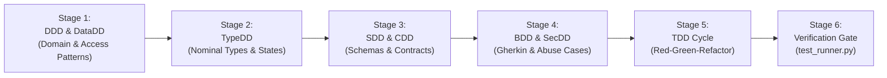

# Driven Development & Test Engineering (DDD, DataDD, TypeDD, SDD, CDD, BDD, SecDD, TDD)

This skill guides the agent to engineer enterprise-grade software through the complete **Driven Design & Test Engineering Stack**:
* **Domain-Driven Design (DDD):** Strategic Bounded Contexts, Aggregates, Value Objects, and Anti-Corruption Layers (ACL).
* **Data-Driven Design (DataDD):** Schema and storage design driven by Access Patterns (ESR rule, covering indexes, optimistic locking).
* **Type-Driven Design (TypeDD):** Making illegal states unrepresentable (Yaron Minsky) and "Parse, don't validate" (Alexis King) with Branded Types and Discriminated Unions.
* **Spec-Driven Development (SDD):** Schemas as single source of truth (Zod, Pydantic, TypeBox) with compile-time type inference.
* **Contract-Driven Development (CDD):** OpenAPI/Pact consumer-driven contracts preventing breaking changes.
* **Behavior-Driven Development (BDD):** Living documentation with Gherkin scenarios (`Given/When/Then`) and state machine transitions.
* **Security-Driven Development (SecDD):** Automated abuse cases and evil user stories.
* **Test-Driven Development (TDD):** The deterministic Red-Green-Refactor cycle and edge-case invariants.

---

## When to Use

Use this skill whenever:
* Creating a new feature, domain model, endpoint, service, or architectural component from scratch.
* Modeling complex business rules or state transitions where invalid combinations must be prevented.
* Designing database schemas, migrations, and indexes optimized for real-world access patterns.
* Writing or refactoring tests across the Test Pyramid (Unit, Integration, E2E, Load).
* Defining strict validation schemas and API contracts before writing controllers or persistence logic.
* Verifying behavioral compliance using the built-in universal test runner.

## When NOT to Use

* For deep vulnerability audits on existing production code (use `appsec-auditor`).
* For 360° holistic evaluation across the entire repo (use `full-app-validator`).
* For sub-100ms classification, routing, or agent tool guardrails (use `jev-system-one`).

---

## The 6-Stage End-to-End Driven Lifecycle


```mermaid
flowchart LR
    S1["Stage 1:<br/>DDD & DataDD<br/>(Domain & Access Patterns)"] --> S2["Stage 2:<br/>TypeDD<br/>(Nominal Types & States)"]
    S2 --> S3["Stage 3:<br/>SDD & CDD<br/>(Schemas & Contracts)"]
    S3 --> S4["Stage 4:<br/>BDD & SecDD<br/>(Gherkin & Abuse Cases)"]
    S4 --> S5["Stage 5:<br/>TDD Cycle<br/>(Red-Green-Refactor)"]
    S5 --> S6["Stage 6:<br/>Verification Gate<br/>(test_runner.py)"]
```

### Stage 1: Domain Boundaries & Storage Physics (DDD / DataDD)
1. **Strategic Bounded Contexts:** Isolate subdomains and establish Anti-Corruption Layers (ACL).
2. **Tactical Aggregates:** Enforce the rule of *1 Aggregate per Transaction*. Model Value Objects as immutable.
3. **Access Patterns Matrix:** Document target queries (Q1, Q2, Q3) with SLAs before writing DDL.
4. **Physical Optimization:** Apply the ESR rule (Equality, Sort, Range) and Covering Indexes (`INCLUDE`).
* Guide: [Domain-Driven Design Reference](references/ddd-domain-driven.md)
* Guide: [Data-Driven Design Reference](references/datadd-data-driven.md)

### Stage 2: Invariants in the Type System (TypeDD)
1. **Zero Illegal States:** Model state transitions with Discriminated Unions so invalid combinations fail at compile time.
2. **Branded Nominal Types:** Eliminate primitive obsession (`UserId` vs `AccountId`).
3. **Parse, Don't Validate:** Transform untrusted raw inputs into certified domain types at the boundary.
4. **Exhaustiveness Guarantee:** Use `assertNever` in all union switches.
* Guide: [Type-Driven Design Reference](references/typedd-type-driven.md)

### Stage 3: Specification & Contract First (SDD / CDD)
1. Define runtime schemas (Zod `.strict()`) as the **Single Source of Truth**.
2. Infer types directly from schemas (`z.infer<typeof Schema>`).
3. Lock API contracts with OpenAPI / Pact consumer-driven contracts.
* Guide: [Spec-Driven Development Reference](references/sdd-spec-driven.md)
* Guide: [Contract-Driven Testing Reference](references/cdd-contract-testing.md)

### Stage 4: Acceptance Scenarios & Abuse Cases (BDD / SecDD)
1. Document business requirements in Gherkin (`Given/When/Then`).
2. Define boundary state transitions in a `Scenario Outline`.
3. Draft the **Evil User Story** (e.g. concurrent race condition, BOLA access attempt).
* Guide: [BDD & Living Documentation](references/bdd-gherkin-scenarios.md)
* Guide: [SecDD Abuse Cases & Exploit Tests](references/secdd-abuse-cases.md)

### Stage 5: The TDD Cycle (Red-Green-Refactor)
1. **🔴 RED:** Write the unit test asserting the expected invariant. Run the test to confirm it fails.
2. **🟢 GREEN:** Write the minimal code needed to make the test pass.
3. **🔵 REFACTOR:** Clean up code, remove duplication, and improve abstractions while keeping tests green.
* Guide: [TDD Protocol & AAA Pattern](references/tdd-red-green-refactor.md)

### Stage 6: Full Pyramid Automation & Verification
1. Structure tests according to the [Test Pyramid Strategy](references/test-pyramid-strategy.md) (70% Unit, 20% Integration, 10% E2E).
2. Execute the built-in test runner to confirm 100% green builds.
* Guide: [The Driven Pipeline Composition Matrix](references/driven-pipeline-matrix.md)

---

## Executable Tool: Universal Test Runner

This skill includes `scripts/test_runner.py`, an auto-detecting test runner supporting:
* **Node.js:** Vitest, Jest, npm/pnpm/yarn/bun test.
* **Python:** Pytest, unittest.
* **Go:** `go test ./...`.
* **Rust:** `cargo test`.

### Execution:
```bash
# Text format with summary metrics
python3 skills/driven-development/scripts/test_runner.py --dir .

# Structured JSON output for agents
python3 skills/driven-development/scripts/test_runner.py --dir . --format json
```

---

## Practical Examples & Fixtures
* [TypeDD State Machine & Branded Types](examples/typedd-state-machine.ts): Hermetic states and nominal identifiers.
* [DataDD Access Patterns & ESR Indexes](examples/datadd-access-patterns.sql): PostgreSQL DDL with covering index and optimistic lock.
* [SDD Zod Schema Example](examples/sdd-zod-schema.ts): Strict schema with refinement and type inference.
* [TDD Lifecycle Test](examples/tdd-lifecycle.test.ts): Unit test with AAA pattern and invariant boundaries.
* [BDD Gherkin Feature](examples/bdd-order-flow.feature): Multi-currency order authorization with Scenario Outlines.
