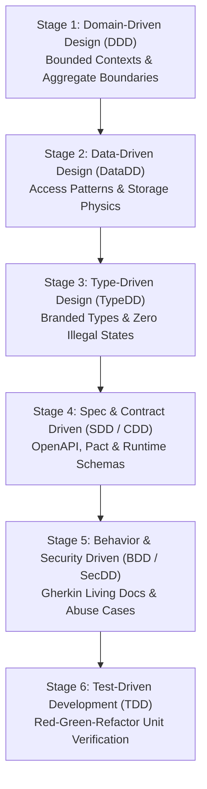

# The Driven Pipeline Matrix – Composing Methodologies in Production

No modern production architecture uses a single "Driven" methodology in isolation. As established in the industry, engineering teams combine **3 to 5 complementary methodologies** to form a coherent, end-to-end design and verification pipeline.

---

## 1. The 6-Stage End-to-End Driven Pipeline

---

## 2. Methodology Composition by Architecture Archetype

| Archetype | Recommended Stack (3-5 Driven Approaches) | Primary Rationale |
| :--- | :--- | :--- |
| **Fintech / Core Banking** | **DDD + TypeDD + DataDD + SecDD + TDD** | Invariants must be mathematically proven (TypeDD), financial records need strict consistency (DDD/DataDD), fraud and concurrency must be tested (SecDD). |
| **B2B SaaS / Multi-Tenant API** | **DDD + CDD + SDD + TypeDD + BDD** | Strong tenant isolation, contract stability for consumers (CDD), runtime schema gates (SDD), and business feature alignment (BDD). |
| **High-Throughput Streaming & IoT** | **DataDD + TypeDD + CDD + TDD** | Physical storage and partitioning drive performance (DataDD), compact zero-cost type guarantees (TypeDD), event schema registry (CDD). |
| **E-Commerce & Retail** | **DDD + BDD + SDD + TDD + SecDD** | Complex domain checkout state machines (DDD/TypeDD), promotions and business rules (BDD), coupon fraud and race conditions (SecDD). |

---

## 3. Hand-off Protocols Between Methodologies

1. **From DDD to DataDD:** The Aggregate Root boundary defined in DDD becomes the primary consistency unit; DataDD maps how this aggregate is queried and stored.
2. **From DataDD to TypeDD:** Database constraints (`NOT NULL`, foreign keys, enums) are encoded directly as TypeScript/Rust types and branded nominal identifiers.
3. **From TypeDD to SDD/CDD:** The internal types are projected outward as runtime validation schemas (Zod/Pydantic) and OpenAPI/Pact contracts.
4. **From CDD to BDD/SecDD:** Contract endpoints become the steps in Gherkin scenarios (`When client calls POST /transfers`) and targets for evil user stories.
5. **From BDD/SecDD to TDD:** Acceptance scenarios guide the creation of unit test fixtures and drive the inner Red-Green-Refactor loop.
