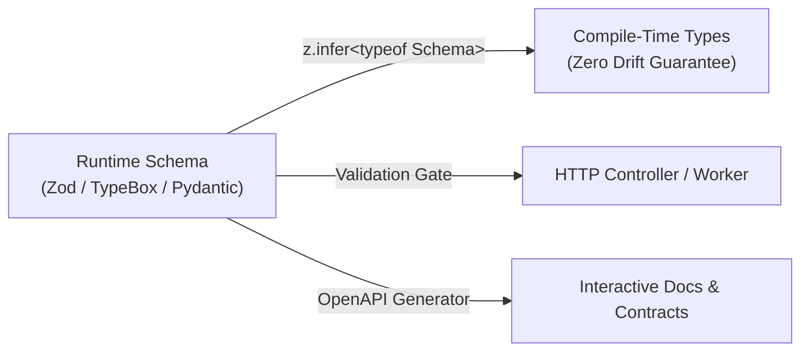

# Spec-Driven Development (SDD) & Schema-First Engineering

**Spec-Driven Development (SDD)** establishes that no implementation code should be written before the technical specification (RFC/SDD) and the formal data validation schemas are defined, reviewed, and finalized.

---

## 1. The Core Principle: Schemas as Single Source of Truth

Never define TypeScript types or database models manually before establishing the validation schema. The runtime validator must strictly infer the compile-time type:



### ✅ Example (TypeScript / Zod):
```typescript
import { z } from "zod";

// 1. Single Source of Truth: Runtime Schema with strict constraints
export const CreateOrderInputSchema = z.object({
  customerId: z.string().uuid(),
  items: z.array(
    z.object({
      sku: z.string().regex(/^[A-Z]{3}-\d{4}$/, "SKU must match format ABC-1234"),
      quantity: z.number().int().positive().max(100),
      unitPriceCents: z.number().int().positive(),
    })
  ).min(1, "Order must contain at least one item"),
  currency: z.enum(["BRL", "USD", "EUR"]).default("BRL"),
  idempotencyKey: z.string().min(16).max(128),
}).strict(); // Rejects unknown properties (prevents Mass Assignment)

// 2. Compile-Time Type inferred automatically:
export type CreateOrderInput = z.infer<typeof CreateOrderInputSchema>;
```

---

## 2. Anatomy of a Software Design Document (SDD / RFC)

Before creating non-trivial features, draft a lightweight specification document in `docs/sdd/<feature-name>.md`:

1. **Context & Problem Statement:** Why is this change needed? What user or technical pain point is addressed?
2. **Non-Goals:** What is explicitly out of scope for this iteration?
3. **Data Model & Schemas:** Strict Zod/JSON-Schema definitions.
4. **Error Handling & Failure Modes:** Specific error codes and fallback mechanisms.
5. **Security & Boundary Analysis:** Multi-tenancy isolation and input sanitization.
6. **Observability:** Metrics to expose, traces to propagate, and structured log events.
