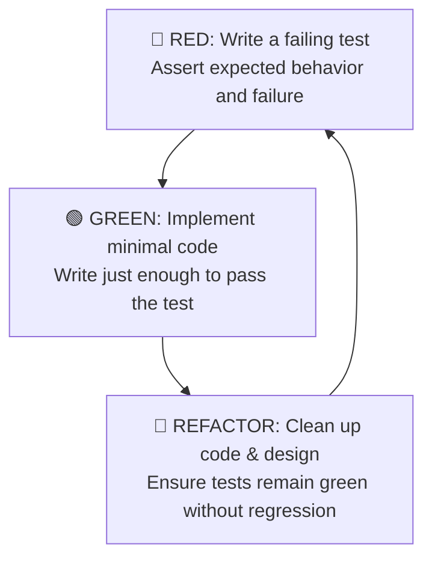

# Test-Driven Development (TDD): The Red-Green-Refactor Cycle

Test-Driven Development (TDD) ensures that code is born with high cohesion, loose coupling, deterministic reproducibility, and zero untracked edge cases.

---

## 1. The Red-Green-Refactor Protocol



1. **🔴 Red Phase:**
   - Write a unit test that defines a single requirement or edge case.
   - Run the test suite: **confirm that it fails as expected** (test the test).
   - If it passes without code changes, the test is invalid or redundant!

2. **🟢 Green Phase:**
   - Write the simplest, most straightforward code that satisfies the test.
   - Do not optimize prematurely; prioritize correctness and meeting invariants.

3. **🔵 Refactor Phase:**
   - Eliminate duplication, improve naming, apply design patterns (SOLID).
   - Re-run test suite after every small modification to guarantee zero regressions.

---

## 2. The AAA (Arrange-Act-Assert) Pattern

Every unit test must strictly follow the AAA structure:

```typescript
test("should calculate compound discount correctly when coupon is applied", () => {
  // 1. Arrange: Setup fixtures and deterministic test data
  const baseOrder = createTestOrder({ totalCents: 10000 });
  const coupon = { code: "SPRING20", discountPercentage: 20 };

  // 2. Act: Execute the single unit under test
  const finalPriceCents = applyCouponDiscount(baseOrder, coupon);

  // 3. Assert: Verify post-conditions and invariants
  expect(finalPriceCents).toBe(8000);
});
```

---

## 3. Anti-Overmocking Directives

* ❌ **Do NOT mock pure business logic, domain entities, or utility functions.**
* ✅ **Mock ONLY external, non-deterministic boundaries:**
  - Outbound third-party HTTP requests (Stripe, Twilio, SendGrid).
  - System clock / timestamps (use fake timers).
  - Heavy cloud services (use local testcontainers or in-memory repositories).
