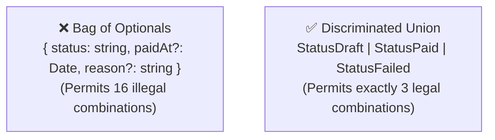

# Type-Driven Design (TypeDD) Reference Guide

**Type-Driven Design (TypeDD)** leverages the static type checker as an automated proof engine. Rather than relying on runtime unit tests to check trivial validity, TypeDD uses static types to mathematically prove the absence of invalid states.

---

## 1. Yaron Minsky's Golden Rule
> *"Make illegal states unrepresentable."*

If an entity cannot legally be in a state where field `B` exists without field `A`, the type system must make it a **compile-time error** to instantiate that state.



### Discriminated Unions for State Machines:
```typescript
// ❌ Bag of Optionals (Weak / Error-prone)
interface Order {
  status: 'draft' | 'paid' | 'cancelled';
  paidAt?: Date;
  cancelReason?: string;
}

// ✅ TypeDD State Machine (Impossible to construct invalid states)
export type Order =
  | { readonly status: 'draft'; readonly createdAt: Date }
  | { readonly status: 'paid'; readonly paidAt: Date; readonly transactionId: TransactionId }
  | { readonly status: 'cancelled'; readonly cancelledAt: Date; readonly reason: NonEmptyString };
```

---

## 2. Alexis King's Golden Rule
> *"Parse, don't validate."*

A validator checks a condition and returns a boolean. The caller still holds the untyped primitive and must remember whether it was validated. A parser **refines the input into a brand new, certified type**:

```typescript
// ❌ Validate: Caller gets boolean, still holds raw string
function isValidCpf(cpf: string): boolean { /* ... */ }

// ✅ Parse: Caller receives certified Cpf type or explicit error
export function parseCpf(raw: string): Result<Cpf, 'INVALID_FORMAT' | 'CHECKSUM_FAILED'> {
  const sanitized = raw.replace(/\D/g, '');
  if (!/^\d{11}$/.test(sanitized)) return err('INVALID_FORMAT');
  if (!validateCpfChecksum(sanitized)) return err('CHECKSUM_FAILED');
  return ok(sanitized as Cpf);
}
```

---

## 3. Branded Types (Nominal Typing)

Prevents accidental parameter transposition (`transfer(sourceId, targetId)`):
```typescript
declare const brand: unique symbol;
export type Brand<T, B> = T & { readonly [brand]: B };

export type AccountId = Brand<string, 'AccountId'>;
export type CustomerId = Brand<string, 'CustomerId'>;

export function transferFunds(from: AccountId, to: AccountId, amount: number) {
  // Compiler error if a CustomerId is passed here!
}
```

---

## 4. Exhaustive Pattern Matching (`assertNever`)

Ensures that adding a new variant to a union causes compile-time errors in all unhandled switches:
```typescript
export function assertNever(x: never): never {
  throw new Error(`Unhandled union variant: ${JSON.stringify(x)}`);
}

export function handleOrder(order: Order): string {
  switch (order.status) {
    case 'draft': return 'Waiting for payment';
    case 'paid': return `Processed at ${order.paidAt.toISOString()}`;
    case 'cancelled': return `Cancelled: ${order.reason}`;
    default: return assertNever(order); // Compiler fails if a 4th state is added to Order!
  }
}
```
