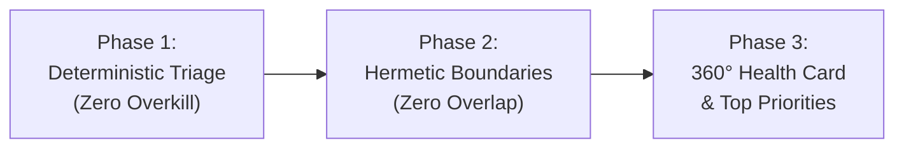

# Full App Validator (360° Holistic Assessment — Zero Overkill & Zero Overlap)

This skill equips the agent to perform an end-to-end, holistic health and architecture assessment across an entire application without the common pitfalls of AI-driven reviews: **scope overlap** (redundant auditing of the same concepts across layers) and **analytical overkill** (exhausting tokens reading non-critical files).

It combines the **Mantis closed-loop pipeline**, **Jev System One cascaded triage**, and **OWASP ASVS / Driven Development standards** into a single unified health check.

---

## When to Use

Use this skill whenever:
* The user asks for a complete, 360-degree, or holistic review of an application or repository.
* You need to evaluate the application's maturity across all pillars: Architecture, Security, Test Quality, and DevOps.
* You need a fast, non-overkill assessment to understand project health before planning a major refactor or security audit.
* Generating an executive **360° Health Card** with prioritized, actionable recommendations.

## When NOT to Use

* For deep line-by-line penetration testing or SARIF generation of an API (use `appsec-auditor`).
* For pure TDD code implementation of a single feature (use `driven-development`).
* For sub-100ms runtime guardrails inside LLM production pipelines (use `jev-system-one`).

---

## 3-Phase Holistic Validation Workflow



### Phase 1: Local Deterministic Triage (Anti-Overkill)
Before engaging in LLM reasoning over hundreds of files, gather deterministic ground truth:
1. **Run the Health Card Script:**
   ```bash
   python3 skills/full-app-validator/scripts/health_card.py --root .
   ```
2. **Execute Test Suites:** Run the existing tests using `test_runner.py` or the project's native runner (`pytest`, `npm test`, `cargo test`).
3. **Inspect Git Health:** Check recent commit churn and uncommitted changes (`git status`).

Consult [Anti-Overkill Cascaded Triage](references/anti-overkill-cascade.md) for details.

### Phase 2: Hermetic Boundary Analysis (Zero Overlap)
Audit each structural layer strictly against its dedicated responsibility, ensuring zero cross-boundary redundancy:
* **1. Edge & Contracts:** Route definitions, strict schema validation (Zod/Pydantic/OpenAPI), and auth token extraction.
* **2. Core Domain:** Business invariants, transaction idempotency (`Idempotency-Key`), and race conditions (DDD).
* **3. Persistence & DB:** Tenancy scoping (`tenant_id`), SQLi/NoSQLi prevention, and migration tracking.
* **4. Quality & Tests:** Test pyramid distribution, AAA structure, and abuse tests (SecDD).
* **5. DevOps & SRE:** Dockerfile rootless/multi-stage configurations, CI/CD secret protection, and graceful shutdown.

Consult [Domain Boundaries Matrix](references/domain-boundaries-matrix.md) for boundary contracts.

### Phase 3: Consolidated 360° Health Card & Action Plan
Generate the final diagnostic report containing:
1. **Pillar Score Matrix:** Numerical score (0-100) and status across all 5 domains.
2. **Executive Health Card:** Clear status badges (🟢 OPTIMAL, 🟡 ACCEPTABLE, 🟠 ATTENTION, 🔴 CRITICAL).
3. **Top 3 to 5 Actionable Priorities:** Focused exclusively on highest-leverage improvements.

---

## Executable Tools & Scripts in this Skill

### Generating 360° Health Card via CLI
```bash
# Generate Markdown report directly to terminal or file
python3 skills/full-app-validator/scripts/health_card.py --root . --output docs/health-card.md

# Generate structured JSON for CI/CD metrics dashboards
python3 skills/full-app-validator/scripts/health_card.py --root . --json
```

---

## Verified References & Guides
* [Domain Boundaries Matrix (Zero Overlap)](references/domain-boundaries-matrix.md): Clear demarcation of responsibilities per layer.
* [Anti-Overkill Cascaded Triage](references/anti-overkill-cascade.md): Progressive 3-tier inspection protocol.
