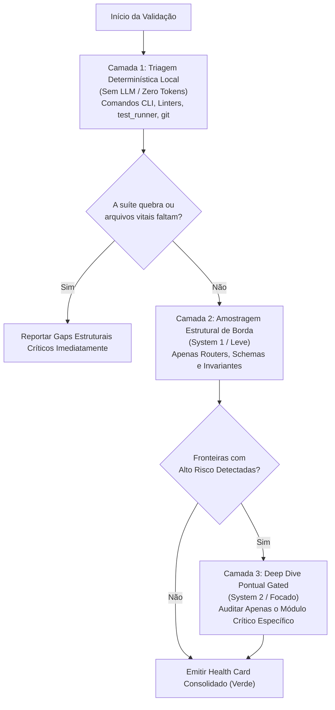

# Triagem Progressiva em Cascata (Zero Overkill)

O **Overkill** em agentes de IA ocorre quando o modelo tenta ler centenas de arquivos de código linha por linha logo no início da auditoria, consumindo milhares de tokens e gerando fadiga com centenas de alertas menores e irrelevantes.

Inspirado no padrão de **Two-Model Cascade** (System 1 + System 2) do Jev e no **Mantis Planner**, esta referência estabelece o protocolo de **Triagem Progressiva em 3 Camadas**.

---

## 1. O Pipeline em Cascata de 3 Camadas

---

## 2. Detalhamento Operacional das Camadas

### Camada 1: Verificação Determinística Local (Zero Token Waste)
Antes de pedir para o LLM "ler código", utilize comandos rápidos locais:
1. **Executor de Testes:** Rode `test_runner.py` ou o comando nativo (`pytest`, `npm test`, `go test`, `cargo test`).
   - Se 10 testes falharem por erro de compilação ou regressão, isso é um fato objetivo.
2. **Scanner Estrutural:** Execute `python3 skills/full-app-validator/scripts/health_card.py --root .`.
   - Gera instantaneamente o mapa de ativos existentes sem custo de inferência.
3. **Verificação Git:** `git status` e `git log -n 5` para saber o estado do repositório.

### Camada 2: Amostragem Estrutural das Fronteiras
Inspecione apenas os arquivos sentinela que definem as fronteiras:
- *Borda:* O arquivo central de rotas (`app.ts`, `routes/index.ts`, `main.py`).
- *Contratos:* Um ou dois schemas principais para verificar se usam `.strict()` ou campos tipados.
- *Persistência:* A inicialização do cliente de banco (verifica se usa pool seguro, TLS e ORM).
- *CI/CD:* O arquivo principal de workflow (`.github/workflows/ci.yml`).

### Camada 3: Deep Dive Pontual Gated (Apenas Onde Necessário)
Se a Camada 2 apontar que um controller expõe uma ação financeira sensível sem validação evidente de tenant, **apenas esse arquivo e seu respectivo service** recebem análise aprofundada de código.
Arquivos auxiliares, componentes estáticos ou utilitários puros de formatação de string **NÃO devem ser analisados**.

---

## 3. Regras de Ouro Anti-Overkill

1. **Evidência Antes de Afirmação:** Nunca reporte que "o sistema pode sofrer DoS" a menos que haja um sink não-limitado observável.
2. **Máximo de 3 a 5 Ações Prioritárias:** Um relatório com 40 recomendações não é executado por nenhuma equipe. Forneça os 3 a 5 pontos de maior alavancagem técnica.
3. **Soluções Drop-in:** Cada recomendação deve ter clareza de implementação imediata.
