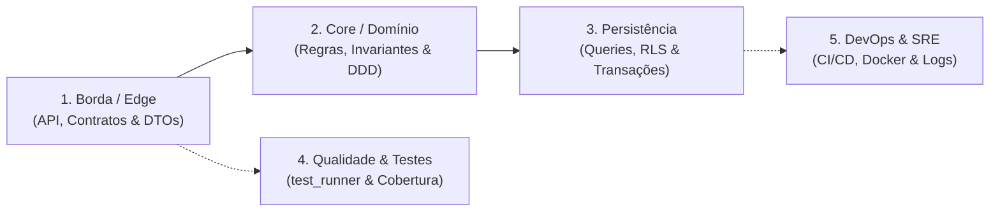

# Matriz de Fronteiras de Domínio (Zero Overlap)

A causa primária de lentidão, estouro de contexto e análises conflitantes em IA é a **sobreposição de escopo (*overlap*)** — múltiplos prompts ou etapas tentando auditar o mesmo arquivo ou conceito (ex: validar parâmetros no controller, no service e na query SQL).

Esta matriz define contratos herméticos de responsabilidade exclusiva: cada camada é inspecionada uma única vez pelo seu vetor específico.

---

## 1. As 5 Fronteiras Herméticas da Aplicação

| Fronteira | Responsabilidade EXCLUSIVA | O que NÃO deve ser auditado aqui (Evita Overlap) |
| :--- | :--- | :--- |
| **1. Borda & Contratos (API/Edge)** | - Roteamento HTTP/gRPC/GraphQL. - Parsing e validação de schema de entrada (Zod, Pydantic, OpenAPI). - Rejeição de campos extras com `.strict()` (Anti Mass Assignment). - Autenticação e extração de identidade de sessão (`req.user`). - Headers de segurança (CORS, CSP, HSTS). | ❌ Não audita queries de banco de dados. ❌ Não audita regras de negócio de checkout/cálculo. ❌ Não analisa Dockerfiles ou CI/CD. |
| **2. Domínio & Core de Negócio** | - Invariantes e regras de negócio essenciais (DDD). - Chaves de idempotência em transações financeiras (`Idempotency-Key`). - Prevenção de condições de corrida (TOCTOU) e pulo de etapas. - Modelagem semântica documentada (`CONTEXT.md`). | ❌ Não audita formatação de JSON ou rotas HTTP. ❌ Não audita dialetos de SQL. ❌ Não audita pipelines de deploy. |
| **3. Persistência & Dados (DB)** | - Parametrização estrita de queries (Prevenção de SQLi/NoSQLi). - Restrição de escopo multitenant (`where: { tenant_id }`) e RLS. - Controle transacional (ACID) e isolamento em operações concorrentes. - Versionamento de migrações e criptografia de campos sensíveis (KMS). | ❌ Não audita validação de input de controllers (já feito na Borda). ❌ Não re-audita tokens JWT de usuário. ❌ Não audita arquivos de teste unitário. |
| **4. Qualidade & Testes (QA/TDD)** | - Execução real de testes locais (`pytest`, `npm test`, `test_runner.py`). - Distribuição da pirâmide de testes (Unitários AAA > Integração > E2E). - Presença de testes de abuso (SecDD) para cenários negativos. - Saúde de dependências e cobertura de código. | ❌ Não faz code review de estilo de código. ❌ Não audita infraestrutura de nuvem. ❌ Não repete testes funcionais manuais. |
| **5. DevOps, SRE & Resiliência** | - Hardening de containers (Docker rootless, multi-stage builds). - Segurança em CI/CD (OIDC federado, pinning SHA-256 de actions, sem secrets). - Circuit Breakers, retries com jitter e Graceful Shutdown. - Observabilidade (OpenTelemetry, logs estruturados sem PII). | ❌ Não audita regras de negócio da aplicação. ❌ Não audita DTOs de APIs. ❌ Não audita schemas do banco. |

---

## 2. Princípio de Não-Interferência

Se um problema for detectado na **Borda** (ex: endpoint aceita campo arbitrário sem validação Zod), ele deve ser registrado como **Falha de Borda**.
O auditor NÃO deve registrar a mesma falha na camada de **Persistência** alegando que o campo pode atingir o banco; cada fronteira possui seu próprio mecanismo de contenção em Defesa em Profundidade.
