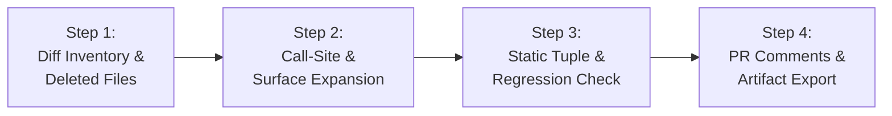

# Security Diff Scan (Surgical PR & Git Diff Review)

This skill equips the agent to perform **high-density, surgical security audits on Pull Requests, commits, and Git diffs** without the token exhaustion and scope drift of a whole-repository scan.

Inspired by the **OpenAI Codex Security** diff review engine (`security-diff-scan`), **OWASP API Security Top 10 (2023)**, and **OWASP ASVS v4.0.3**, it inspects modified, added, and deleted files, follows changed behavior into direct callers, and emits actionable code review feedback.

---

## When to Use

Use this skill whenever:
* The user asks to review a Pull Request (`git diff origin/main...HEAD`), a commit range, or staged changes for security.
* Evaluating whether a code change introduces new vulnerabilities, weakens existing controls, or exposes sensitive endpoints.
* Running fast pre-merge security checks in CI/CD pipelines (GitHub Actions, GitLab CI).
* Generating inline PR review comments in Markdown or exporting a diff-focused SARIF report.

## When NOT to Use

* For full-repository 360° audits without a diff to review (use `appsec-auditor`).
* For evaluating the auto-merge risk and contract preservation of an immutable patch without editing (use `patch-risk-assessment` or `prompts/security/patch_risk_assessment.md`).
* For triaging third-party scanner alerts (Snyk, Dependabot) without inspecting PR changes (use `triage-findings` or `prompts/security/triage_findings.md`).
* For architectural threat modeling before code exists (use `threat-modeler` or `prompts/security/threat_modeling.md`).

---

## 4-Step Diff Review Workflow



### Step 1: Diff Inventory & Change Boundary Isolation
1. **Extract Changed Files:** Identify added (`A`), modified (`M`), and deleted (`D`) files:
   ```bash
   python3 skills/security-diff-scan/scripts/diff_scanner.py --base origin/main --head HEAD
   ```
2. **Review Deleted Code:** Pay close attention to removed files or lines. Deleting code often inadvertently removes tenancy filters, rate limits, or input sanitizers.
3. **Isolate Scope:** Anchor the analysis strictly to the modified files and their direct dependencies.

### Step 2: Call-Site & Contract Expansion
If the diff modifies a shared helper, route pattern, ORM query builder, or middleware:
* Trace all direct callers of that modified helper in the repository.
* Confirm that sibling endpoints using the changed helper remain secure and did not suffer regressions.

### Step 3: Systematic Vulnerability & Regression Inspection
Inspect each chunk using the **Static Assessment Tuple**:
* **Source:** Is any newly accepted parameter or route input controllable by an external attacker?
* **Control:** Did the diff remove, bypass, or relax any authentication, authorization, or schema validation check?
* **Sink:** Does the modified code reach dangerous sinks (raw SQL, system commands, SSRF endpoints, unrestricted file writes)?
* **Counterevidence:** Verify if upstream middlewares, global DTO pipes, or reverse proxies already neutralize the input.

Consult [Diff Review Methodology](references/diff-review-methodology.md) and [Regression Checklist](references/regression-checklist.md).

### Step 4: PR Review Feedback & Artifact Export
Generate the structured code review report and export SARIF if requested:
```bash
python3 skills/security-diff-scan/scripts/diff_scanner.py \
  --base origin/main \
  --head HEAD \
  --output pr-security-review.md \
  --sarif results.sarif
```

---

## Executable Script in this Skill

### `scripts/diff_scanner.py`
The skill includes a standalone, deterministic Python CLI to inspect git diffs or patch files:

```bash
# Scan working tree against main:
python3 skills/security-diff-scan/scripts/diff_scanner.py --base origin/main

# Scan a specific patch file:
python3 skills/security-diff-scan/scripts/diff_scanner.py --patch /path/to/pr.patch --format json
```
