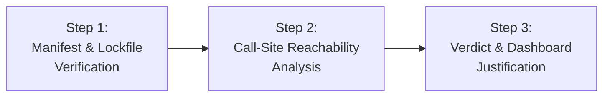

# Triage Finding (Static Reachability & Alert Triage)

This skill equips the agent to perform **fast, deterministic triage of third-party security findings and CVEs** against the static evidence of the repository, separating actionable vulnerabilities from harmless dependencies and false positives.

Directly adapted from the **OpenAI Codex Security** triage engine (`triage-finding`), it provides clear verdicts without running expensive whole-repository audits or dynamic penetration tests.

---

## When to Use

Use this skill whenever:
* Triaging alert backlogs from Dependabot, Snyk, Trivy, CodeQL, or bug bounty tickets.
* Verifying if a reported CVE or library vulnerability is actually reachable and called by product code.
* Generating formal justifications to dismiss false positive alerts in security dashboards.
* Classifying candidate findings before initiating engineering remediation workflows.

## When NOT to Use

* For whole-repository penetration testing or discovering vulnerabilities from scratch (use `appsec-auditor`).
* For reviewing Pull Requests and git diffs (use `security-diff-scan`).
* For designing and hardening the code patch of an already confirmed issue (use `adversarial-patching`).

---

## The 3 Formal Triage Verdicts

For every analyzed finding or CVE, return exactly ONE verdict:

| Verdict | Meaning | Technical Criteria in Repository |
| :--- | :--- | :--- |
| **`confirmed`** | **Actionable Vulnerability** | The vulnerable dependency/method is imported, executed in an active runtime path, and reachable from external user input. |
| **`not_actionable`** | **False Positive / Benign** | The package exists in manifest but the affected method is never called (dead code); or the package is strictly dev/test; or upstream controls neutralize the vector. |
| **`needs_review`** | **Inconclusive / Dynamic Analysis Needed** | Indirect calls, dynamic module loading, reflection, or library code where caller reachability cannot be determined statically. |

---

## 3-Step Triage Workflow



### Step 1: Manifest & Lockfile Verification
1. Confirm the reported library and exact version in `package.json`, `poetry.lock`, `Cargo.lock`, etc.
2. Determine if the dependency is `dependencies` (production runtime) or `devDependencies` (build/test only).

### Step 2: Call-Site Reachability Analysis
1. Search the codebase for imports of the affected package.
2. Check if the specific vulnerable function, class, or API named in the advisory is invoked.
3. If invoked, check if untrusted data reaches the invocation or if inputs are hardcoded constants.

### Step 3: Verdict & Dashboard Justification
Execute the standalone triage script to evaluate alerts against the local workspace:
```bash
python3 skills/triage-finding/scripts/triage_evaluator.py \
  --findings skills/triage-finding/examples/findings_sample.json \
  --repo-root . \
  --format markdown
```

---

## Executable Tool in this Skill

### `scripts/triage_evaluator.py`
A deterministic CLI tool that assesses alert payloads against codebase imports and call sites:

```bash
# Triage alert list in JSON format:
python3 skills/triage-finding/scripts/triage_evaluator.py --findings alerts.json --repo-root .

# Output formatted Markdown for issue resolution:
python3 skills/triage-finding/scripts/triage_evaluator.py --findings alerts.json --format markdown
```
